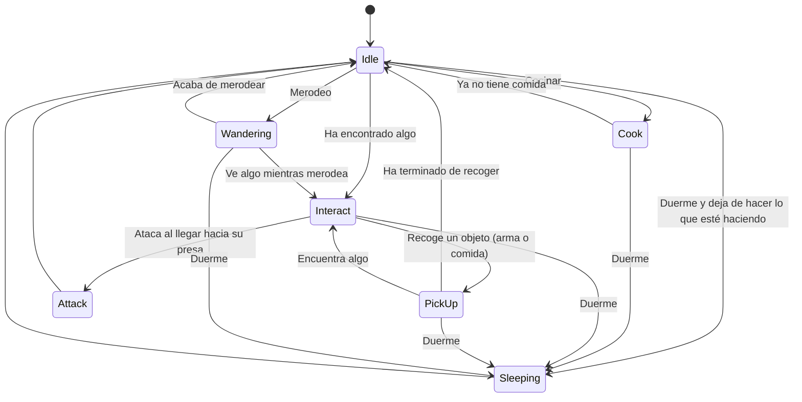

# IA-ProyectoFinal
## Autores
- Sara Isabel Garcia Moral (sarais02). Encargada de hacer lo comportamientos de los enemigos (ver más abajo).
- Javier Comas de Frutos (javixxu). Encargado de la herramienta de creacion de mundos procedurales y objectos colocados proceduralmente a lo largo del mapa

## Propuesta

### Herramienta de Creacion de Mundos Procedurales
La creacion de un mundo procedural completamente parametrizada con sistema de capas de terreno y creacion de objectos a lo largo de este.Ademas dicho terreno
generado ha de estar optimizado para que se pueda llegar a generar una gram superfice de terreno.

Como la creacion de un mundo completamente "aleatorio" puede resultar algo compleja se ha decidido establecer los siguientes parametros para que el usuario
pueda modificar a su antojo para crear el mundo con el terreno y objectos que desee):
  - int mapSize: Tamaño del Mapa
  - float NoiseScale: El factor de escala del ruido generado. Un valor mayor producirá un ruido con detalles más finos
  - int Octaves:  El número de octavas utilizadas en el algoritmo de ruido.Cada octava es una capa de ruido que se suma al resultado final.
    A medida que se agregan más octavas, el ruido generado se vuelve más detallado
  - float Persistance: Controla la amplitud de cada octava.Un valor más bajo reducirá el efecto de las octavas posteriores de las octavas posteriores
  - float Lacunarity: Un multiplicador que determina qué tan rápido aumenta la frecuencia para cada octava sucesiva en una función de ruido de Perlin
  - int Seed: Numero aleatorio utilizado para generar el ruido
  - Vector2 Offset: La posición inicial del ruido generado
  - TerrainType[]regions: Layers del terreno que se pueden generar
  - ObjectInMap[]objects: Objectos que se pueden generar a lo largo del mapa
  - bool useFallOff: Generar un suavizado en el ruido generado de tal forma que el mapa tenga forma de isla
  - bool autoUpdate: Cuando se realize un cambio des de el editor, auto actualizar el mapa
  - bool autoRegenerate: Cuando se inicilize este componente autoregenerar el terreno


Establecidos todos estos parametros tendremos varias posibilidades, tipos de configuracion para la generacion. Es posible que nosotros queramos previsualizar el mapa que estemos generando en 2D antes que 3D para ello,
tendremos varios modos de creacion:
  - NoiseMap: Generacion de un Mapa de Con los layers de terreno establecidos(Solo visual 2D)
  - ColorMap: Generacion de un Mapa de Ruido con  los bordes del terreno suavizados(Solo visual 2D)
  - FallOff: Generacion de un Mapa de Con los layers de terreno establecidos(Solo visual 3D)
  - NoObjects: Generacion de un Mapa de Con los layers de terreno establecidos y los Objectos puestos para generar(Solo visual 3D)
  - Objects: Generacion de un Mapa de Con los layers de terreno establecidos y los Objectos puestos para generar(Solo visual 3D)
  - NobjectsWithDisplay: Configuracion de ColorMap y NoObjects     
  - All: Configuracion de ColorMap y Objects
En el inspector de unity, existe un boton para generar el mapa.

#### Punto de partida
Para el punto de partida es una escena de unity vacia junto a el capitulo del Libro de Milinton 8.3 Landscape Generation en el cual se decriben tecnicas que implican la creacion de paisajes y todo lo que     conlleva(noise, octaves, escalas, procesos geologicos,...).Un vez leido todo, sobre todo los apartados 8.3.1 Modifiers and Height-Map 8.3.2 Noise y 8.3.3 PerlinNoise, en estos se explica la generacion de mundos mediante la aplicacion de modificadores y como la mayoria de juegos generan paisajes utilizando mapas de alturas que contienen datos de elevacion.Esos datops de elevacion es lo que se considera ruido el cual se configura y ajusta cada ubicacion con cambios de elevacion aleatorios, lo que produce a un mapa de alturas con variaciones de elevacion. Ademas de como funciona El Ruido de Perlin. Tambien se tuvo como referencia varios videos de referencia para entender como funcionaban tanto el ruido de perlin asi como las octavas para que el resultado fuera mucho mas realista.Destaca tambien el Pseudocodigo de milinton:
```
class PerlinOctave:
 gradient: float[][][2]
 size: int

 function PerlinOctave(size: int):
 this.size = size

 #Create a grid of random gradient vectors.
 gradient = float[size + 1][size + 1][2]
 for ix in 0..(size + 1):
  for iy in 0..(size + 1):
    gradient[ix][iy][0] = randomRange(-1, 1)
    gradient[ix][iy][1] = randomRange(-1, 1)

 function scaledHeight(
  ix: int, iy: int,
  x: float, y: float) -> float:
  #Calculate the distance across the cell.
  dx: float = x - ix;
  dy: float = y - iy;

  #Dot product of the vector across cell and the gradient.
  return dx * gradient[ix][iy][0] +
    dy * gradient[ix][iy][1]

 function get(x: float, y: float) -> float:
  #Calculate which cell we are in, and how far across.
  ix = int(x / size)
  iy = int(y / size);
  px = x - ix;
  py = y - iy;

 #Interpolate the corner heights.
  tl = scaledHeight(ix, iy, x, y);
  tr = scaledHeight(ix + 1, iy, x, y);
  t = lerp(tl, tr, px);
  bl = scaledHeight(ix, iy + 1, x, y);
  br = scaledHeight(ix + 1, iy + 1, x, y);
  b = lerp(bl, br, sx);
  return lerp(t, b, sy)
 
class PerlinNoise:
 octaves: PerlinOctave[]
 weights: float[]
 function PerlinNoise(weights: float[]):
  this.weights = weights

#Create random octaves doubling in size.
 size = 1
 for _ in weights:
  octaves.push(PerlinOctave(size))
  size *= 2

 function get(x: float, y: float) -> float:
  result = 0
 for i in 0..octaves.length():
  weight = weights[i]
  height = octaves[i].get(x, y)
  result += weight * height
 return result
 ```
### IA de comportamientos de personajes
Este proyecto consiste en la recreacion del comportamiento lo más realista y organico posible de unos seres que habitan en un bosque. Teniendo en cuenta todo lo que encuentran a su alrededor realizaran unas acciones u otras. En otras palabras, serán capaces de sobrevivir alimentandose de la comida que encuentran o cazando a animales que vean y dormiran por las noches entre otras actividades. Si encuentran algun animal cerca y tiene algun arma lo perseguirán y cuando este cerca lo atacará (cazar), obteniendo al matarlo un numero aleatorio de trozos de comida. Si ven alimentos (frutas y verduras) en las inmediaciones, se acercarán a ellas y las cogerán, acumulando comida. Si tienen comida y han encontrado un fuego, iran al mas cercano para cocinar, gastando toda la comida acumulada que tienen, a no ser que se queden dormidos en el proceso. Si ven algun arma clavada en el suelo, y esa arma es más poderosa que la que llevan en ese momento, o si no tienen arma, la recoerá y cambiará por lo que lleva en ese momento, en cambio si el arma que ven es inferior, la ignorarán. En este proyecto para dar más realismo habrá un ciclo de día y noche, por lo que cuando sea de noche los personajes dejarán lo que esten haciendo y se dormirán. Todo esto se podra ver desde un punto de vista de primera persona.
Al tratarse de una simulacion y no un juego como tal, no acaba, se trata de observar. Para poder "terminar" se deberá cerrar la ventana.

#### Punto De Partida
El punto de partida es una escena de unity vacia en la que se he ido añadiendo los assets mencionados abajo, en el apartado de referencias, las animaciones propias hechas en blender y la maquina de estados proporcionada por la herramienta de Visual Scripting de Unity. No se ha partido de ninguna practica anterior o de ninguna escena prehecha, se ha hecho desde cero.

### Combinacion de ambas propuestas
Sera un nivel en el que los personajes se instanciaran proceduralmente por el mapa junto a los dintintos elementos con los que puede interactuar (tambien generados proceduralmete) y realizara sus distintos comportamientos dependiendo de lo que tengan a su alrededor. Pudiendo ser observados gracias a un controlador en 1ª persona.

## Diseño de la solución

### Herramienta de Creacion de Mundos Procedurales
La Herramienta posee varios "elementos basicos" que facilitan la creacion del mundo:

  - Class Chunk: Un chunk es una porcion 50x50 del mapa generado, esto se debe a que unity no deja crear mas de 65,534 por ello es necesario dividir la malla del mapa en otras mas pequeñas que que todas estas juntas         conformen el mapa.
  
      - Un GameObject Padre con el nombre de Chunk + posMap que contiene a la malla del suelo, bordes y un gameobject que contiene todos los objectos generados en ese chunk.
      -PosMap representa la posicion del chunk en el mapa 

  - Struct TerrainType: Es una capa de terreno que se puede generar. Esta contiene:
  
      - string Layer: Nombre Capa De Terreno
      - height: Altura a la que se puede generar como maximo
      - color: color que va a tener las casillas si se genera un punto de ruido que no supere la altura maxima
  - class ObjectInMap: Son objectsoq ue se pueden generar a lo largo del mapa. Esta Contiene:
  
      - GameObject prefab
      - float Density: Densidad del objecto
      - float NoiseScale: El factor de escala del ruido generado
      - string GenerationLayer: Capa en la que se puede generar el Objecto
  - class Cell: Casilla del Mapa que guarda toda la informacion generada por el ruido de perlin, posteriormente evaluada con las Layers del terreno y 
    los objectos que pueden generarse en ella. Esta contiene:
    
      - TerrainType type: Tipo de terreno
      - float Noise: Ruido genrado en esa casilla
      - float Height: Altura de esa casilla
      - GameObject objectGenerated: Objecto q se ha podido generar encima de la casilla

La Herramienta constara de varios Generadores:

  - Noise: Es el generador de Ruidos de Perlin.Constara de dos Grandes metodos: 
  
      - GenerateNoiseMap(int size,int seed,float noiseScale,int octaves, float persistance, float lacunarity,Vector2 offset) que generara un ruido a partir de los parametros de entrada, 
      devolviendo una matriz de floats con el valor de ruido generado en cada casilla.
      
      - GenerateFalloffMap(int size): Genera un mapa de fallOff para suavizar los bordes del terreno usando esta ecuacion para ello 
   

        Siendo b=2.2 y a=3.De esta forma simulamos una especie de isla combinando la matriz que obtenemos del falloff y la matriz de ruido obtenida en el metodo GenerateNoiseMap
  - TextureGenerator: Es una clase para la creacion de una textura, que servira para la representacion del mapa generado. Constara de dos metodos:
       - TextureFromColorMap(Color[] colorMap,int width,int height): crea una textura y le aplica a cada texel de la texura el valor del array color, creando asi una textura a color.
       - TextureFromNoiseMap(float[,] noiseMap): a su misma vez que el metodo anteior este crea una textura para la representacion del mapa creado pero esta vez en blanco y negro interpolando dichos colores con el               noiseMap que contiene el noise de cada celda
  - MeshGenerator: Es el generador de la malla en 3D, como queremos que la malla que estemos creado sea lo mas eficiente posible solo crearemos las caras visibles, pues el mapa generado esta pensado para que no se le          puedan quitar bloques,trozos, etc. Para ello se ha divido en dos partes, el suelo y los bordes.En ambos hay que definir los vertices, triangulos y coordenadas de textura. Como se ha explicado anteriormente se crean 
     mallas para cada chunk para no exceder el limite de vertices establecido por unity. Constara de tres metodos:
     
      - GenerateTerrainMeshChunk(Cell[,] mapaCells, Vector2 pos, GameObject chunkObject, float sizePerBlock, int chunkSize): Genera el suelo de un Chunk
      - DrawEdgesChunk(Cell[,] mapaCells, Vector2 pos, GameObject edges,float sizePerBlock,int chunkSize): Genera los bordes de un Chunk
      - DrawTextureChunk(Cell[,] mapaCells, Vector2 pos, MeshRenderer renderer, int chunkSize): Crea una textura estableciendo el color de cada texel correspondiente a el color de cada tipo de terreno que hay en cada
        Cell.
  -ObjectsGenerator: Esta clase se encarga de generar proceduralmete objectos por el mapa.
  Esta clase contiene el metodo   GenerateObjects(int mapSize, int chunkSize,float heightPerBlock, Cell[,] cellMap, Dictionary<Vector2,Chunk> chunks, ObjectInMap[] objectsToGenerate), el cual para cada casilla si puede     generar un objecto y recorre el array objectsToGenerate por orden de densidad intentando generar objectos para esa casilla.
  
 El script MapDisplay es el encargado de dibujar el map2D si ha asi ha querido el usuario
 
 Por ultimo Tendremos la clase MapGenerator, que sera la encarga de "Hacer Todo".A su vez hay un script MapGeneratorEditor para facilitar el uso al usuario. Esta tendra todos los parametros indicados en la propuesta y     sera la encargada de llamar a los distintos metods explicados anteriormente     para la generacion del mapa. Esta contendra los siguientes metodos:
 
  - GenerateMap: Genera el mapa con los parametros establecidos
  - GenerateMapByChunks: Es llamado por el metodo anterior y es elencargado de crear los chunks o modificarlos segun sea necesario
  
 #### Metricas:
 
  - A: El mapa generado se puede representar en 2D {A color, el ruido de perlin y el falloff}
  - B: El mapa 3D generado, esta completamente optimizado de manera que la mmala creada es como un quad y solo se renderiza por la superficie, ademas se que solo se crean los vertices unicos y necesarios para la                representacion del mapa. Cuenta con un sistema de chunks que permite identificar entranbdo al gameobject del chunk todo lo que hay en su superficie.Crear un suavizado de bordes para que el terreno generado tenga          forma de isla.
  - C: El mapa generado se puede representar en 3D{Con objectos, Sin Objectos}
  - D : El mapa es completamente parametrizable,el ususario es capaz de determinar: el tamaño del mapa, el numero de octavas , el noisecale, la amplitud de cada octava("persistance"), la freciencia de cada                       octava("lacunarity"), mundos completamente unicos con un entero que el usiario determina("seed"), el offset del ruido y los objectos que quieres generar en el mapa.
  - E: El sistema cuenta con 3 booleandos, uno para regenrar automaticamente el mapa cuando se cambien parametros desde el editor("AutoUpdate"), otro para autoregenerar el mapa cuando entras en ejecucion y por ultimo
       un boleano para ver si kieres aplicar el suavizado de bordes("fallOff").
### IA de los personajes
Los personajes contarán de dos máquinas de estados: comportamientos y animaciones. La máquina de estados de comportamientos tendrá la siguiente forma:

Estados:
- Sleeping: Pasará a este estado desde cualquier otro, siempre y cuando sea de noche. En este estado simplemente realizará la animacionde dormir y no saldrá de este estado hasta que sea por la mañana. Se desactiva el NavMeshAgent ya que no debe moverse y se desactivan todas los booleanos que controlan el paso de animaciones, activando solo la de dormir. Al salir de este estado se vuelve a activar el NavMeshAgent pero se desactiva la animacion de dormir.
- Idle: pasará a este estado por defecto nada más despertarse. Tambien pasará a este estado cuando no tenga nada que hacer. En este estado realizará diversas actividades de manera aleatoria. Estas actividades son 3 animaciones de idle, un merodeo simple por la zona y cocinar. Al entrar a este estado se desactivará el NavMeshAgent ya que debe estar estatico. Tambien desactivara todas las animaciones no relacionadas con el idle. Cada 3 segundos se cambiara de accion con un contador. Para la seleccion de accion se generará un numero aleatorio en el rango (0,4), siendo el numero 0 para una accion de idle generica, el 1 para bailar, el 2 para rascarse, el 3 para cocinar, y el 4 para merodear. Las tres primeras simplemente activan su animacion correspondiente y el NavMeshAgent. Para cocinar debe asegurarse que se cumplen las condiciones de haber visitado un fuego y de tener piezas de comida. Si no se cumplen se fuerza a generar otra accion de forma aleatoria. Si se cumplen, se activara la animacion de andar, se fijará como destino el fuego mas cercano y se pasará al estado de Cook. Para la accion de merodear se activara la animacion de caminar y el NavMeshAgent. Tambien se generará una posicion aleatoria que se guardara en una variable y se cambiará al estado de Wandering.
- Cook: pasa a este estado si la accion de cocinar es seleccionada en el estado Idle. Si ha recolectado comida y tiene un fuego cerca empezara a cocinar la comida que tiene, es decir, cada 2.5 segundos su contador de comida decrementará en 1. Cuando ya no tenga comida que cocinar saldra de este estado. Se desactivara el NavMeshAgent ya que debe estar estaico, al igual que la animacion de caminar, y se activara la animacion de cocinar.
- Interact: pasará a este estado una vez que haya detectado comida, un animal, un arma o al jugador. Una vez que entre en este estado se dirigirá al elemento que haya detectado. Al entrar a este estado se activará la animacion de caminar. Se activará el NavMeshAgent y se fijará como destino el objeto que haya sido detectado por el trigger en ese momento.
- PickUp: entrará en este estado una vez que haya detectado algo que pueda recoger, como un arma o comida y este lo suficientemente cerca como para poder cogerlo. Nada mas entrar se desactivara la animacion de camina y el NavMeshAgent y se activara la animacion de recoger.
- Attack: pasará a este estado una vez que haya divisado y acercado a un animal. Se desactivara su NavMeshAgent y la animacion de andar y se activara la animacionde atacar. Además se generará un numero aleatorio de comida en el rando (1,6) que adquirirá.
- Wandering: es el merodeo, pasa a este estado cuando se selecciona de forma aleatoria su accion en Idle. Al entrar se activa el NavMeshAgent y la animacion de caminar. Si han pasado los 10 segundos asignados a esta accion, si ha llegado a su destino o si el destino es inalcanzable, se sale de este estado.

La maquina de animaciones será de esta forma:


Los cambios entre animaciones estaran determinados por la combinacion de 5 variables, 4 booleanos y 1 int:
- IsWalking: para caminar
- IsPicking: para recoger objetos del suelo
- IsAttacking: para atacar
- IsNight: para dormir si es de noche
- Action: 0 para el idle, 1 para bailar, 2 para rascarse y 3 para cocinar


Implementacion:

Los scripts se encuentran en en la carpeta "IA CHARACTERS". Estos scripts son: AnimalWandering, Enemy, Pickable, TriggerObject. Se explican a continuacion.

- Los elememtos del entorno interactuables tienen un trigger bastante grande para que los personajes puedan detectarlos facilmente y otro trigger más pequeño. El trigger grande se encuentra en un objeto que contiene a otro objeto con el trigger pequeño y al script de Pickable, y el pequeño contiene a otro gameobject (a menudo vacio), con un script TriggerObject. El trigger grande se encarga de guardar ese objeto en una lista del personajes de objetos con los que ha interactuado (Pikable), y el trigger pequeño (TriggerObject) dispara la accion asociada a ese objeto (recoger, atacar ...). Los tipos de objetos vienen identificados por un enum llamado ObjectType. En el caso de que el tipo de objeto sea un arma se guarda su material y malla. Comprueba si el enemigo esta lo suficientemente cerca (entra en el trigger pequeño), y si cumple esta condicion deja de perseguir y: si es un animal y el enemigo tiene arma pasa al estado de atacar; si es comida, pasa al estado de recoger; si es un arma de mayor nivel que la suya pasa al estado de recoger tambien, si no, simplemente la ignora. Una vez realizadas estas acciones los objetos se destruiran y si es un arma, ademas se cambia la malla y el material para hacer el intercambio.
- Cuando el personaje entre en contacto con el trigger pequeño de un objeto, sale del estado Interacting que se encarga de la persecucion y su NavMeshAgent se desactiva para que este quieto.
- Los personajes tienen el script Enemy que gestiona los cambios de estados y todos su comportamientos.
- Los animales tiene el script AnimalWandering que simplemente hace que merodeen generando cada 8.2 segundos una nueva posicion. Si el enemigo esta cerca y los esta atacando paran de merodear.
- El cambio de estados de la maquina y el de las animaciones en su mayoría vienen determinados por booleanos.
- Cocinar: Si tiene comida y ha visitado algun fuego, ira hacia el más cercano, y cuando este a cierta distancia ejecutará la animación de cocinar. Cada 2.5 segundos cocinara 1 pieza de la comida que haya recolectado. Cuando ya no disponga de mas piezas de comida (contador implementado en el script Enemy que tiene cada personaje) pasará a otro estado.
- A las armas se les podrá asignar un nivel, siendo este mayor que 0. Cualquier objeto que tenga nivel 0 no se considerará arma. El personaje al detectar un arma e ir a por ella, si su nivel es inferior al que tiene el arma que maneja actualmente ignorará a esta y se desactivará su trigger para que no la vuelva a tener en cuenta.

La **BUILD** se encuentra en en drive. En la carpeta del proyecto hay un txt llamado Ejecutables_LINKS con el link a drive con un zip con los 2 ejecutables. Es importante comentar que en, sobretodo, la version conjunta, unity no podia bakear todas las esquinas del suelo o algunas zonas no se bakean muy bien por lo que a veces algunos de los personajes se quedan pillados ya que la posicion a la que debe ir es inalcanzable (aunque el navMeshAgent piensa que si es alcanzable). En cuanto se van a dormir esto se arregla porq cambian forzosamente de estado. Hay una carèta también que se llama Demo sara con el video demo de los comportamientos, y hay un txt llamado VIDEO_JAVIER_COMAS_LINK que tiene un link a drivecon el video del mapa procedural.

### Metricas:
- A: Crear las animaciones de los personajes en Blender.
- B: Crear una máquina de estados con las animaciones y la gestion del cambio de estos estados mediante variables.
- C: Crear una maquina de estados en Unity para el complejo comportamiento de los personajes.
- D: Definir los estados y las transiciones entre ellos por codigo.
- E: Crear prefabs para luego generarlos proceduralmente en la escena de juego.
## Controles
El movimiento es el clasico de ordenador, en el que el jugador se mueve con las teclas AWSD y rota la camara con el raton.

## Producción

Las tareas se han realizado y el esfuerzo ha sido repartido entre los autores.

| Estado  |  Tarea  |  Fecha  |  Autores |
|:-:|:--|:-:|:-:|
| ✔ | Mundo procedural simple | 12-05-2023 |Javier|
| ✔ | Terreno procedural | 12-05-2023 |Javier|
| ✔ | Terraformacion | 12-05-2023 |Javier|
| ✔ | Base procedural | 13-05-2023 |Javier|
| ✔ | Generar objetos proceduralmente | 14-05-2023 |Javier|
| ✔ | Maquina de estados y primeros comportamientos | 14-05-2023 |Sara|
| ✔ | Refactorizacion | 14-05-2023 |Javier|
| ✔ | Update cells | 15-05-2023 |Javier|
| ✔ | Refactorizacion | 15-05-2023 |Javier|
| ✔ | Animaciones con blender | 15-05-2023 |Sara|
| ✔ | Ataque arreglado y coger armas | 17-05-2023 |Sara|
| ✔ | Actualización del README | 18-05-2023 |Javier|
| ✔ | Primera escena conjunta | 18-05-2023 |Ambos|
| ✔ | Prefabs propios y arreglo de recoger | 18-05-2023 |Sara|
| ✔ | Actualización del README | 19-05-2023 |Sara|
| ✔ | Accion de cocinar | 20-05-2023 |Sara|
| ✔ | Refactorizacion | 20-05-2023 |Sara|
| ✔ | Comportamiento de animales | 21-05-2023 |Sara|
| ✔ | Prefabs | 21-05-2023 |Sara|
| ✔ | Actualización del README | 22-05-2023 |Sara|
| ✔ | Refactorizacion | 22-05-2023 |Sara|
| ✔ | Refactorizacion | 23-05-2023 |Ambos|
| ✔ | Video | 23-05-2023 |Sara|
| ✔ | Actualización del README | 23-05-2023 |Javier|
| ✔ | Video | 24-05-2023 |Javier|
| ✔ | Refactorizacion | 24-05-2023 |Sara|
| ✔ | Actualización del README | 26-05-2023 |Sara|
| ✔ | Correciones | 29-05-2023 |Sara|

## Referencias
Los recursos de terceros utilizados son de uso público:
- Animales: https://assetstore.unity.com/packages/3d/characters/animals/5-animated-voxel-animals-145754
- Comida: https://assetstore.unity.com/packages/3d/props/food/root-vegetables-set-93392 y https://assetstore.unity.com/packages/3d/props/food/low-poly-fruit-pickups-98135
- Armas: https://assetstore.unity.com/packages/3d/props/weapons/free-low-poly-swords-rpg-weapons-198166
- Fuego: https://assetstore.unity.com/packages/vfx/particles/fire-explosions/low-poly-fire-244190
- Shader de Agua: https://www.youtube.com/watch?v=jRuCQnp78gk&t
- Arboles y rocas: https://assetstore.unity.com/packages/3d/environments/landscapes/low-poly-simple-nature-pack-162153
- Youtube (exportar animaciones de blender a unity, Animator y maquina de estados de las animaciones)
- API Unity
- Libro de Milinton
- Videos de referencia Para la Herramienta de Creacion de Mundos:
   - https://www.youtube.com/watch?v=wbpMiKiSKm8&list=RDCMUCmtyQOKKmrMVaKuRXz02jbQ&start_radio=1&rv=wbpMiKiSKm8&t (Videos 1 2 3 4 )
   - https://www.youtube.com/watch?v=eJEpeUH1EMg
   - https://www.youtube.com/watch?v=XpG3YqUkCTY
